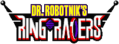

# Dr. Robotnik's Ring Racers for PlayStation 5

<p align="center">
  <a href="https://www.kartkrew.org">
    
  </a>
</p>

An unofficial port of [Dr. Robotnik's Ring Racers](https://www.kartkrew.org/) to
jailbroken PlayStation 5 consoles, as a native title with its own tile on the
home screen.

**It is not affiliated with Kart Krew.** Please do not report problems with this
port to them.

**It has not been run on a console yet.** It builds, links, converts and signs
into a title folder, and every piece follows a PS5 project that has run on
hardware, but the game itself is untested on a PS5. The first runs are the
test: [docs/PS5.md](docs/PS5.md#first-console-test) has a checklist and says
what to send back.

## What it does

The game is upstream Ring Racers, unchanged except for a platform layer in
place of SDL (`src/ps5/`). So both renderers, the sound mixer, netplay, add-ons,
replays and profiles are the PC version's.

* 1080p, 1440p or 4K output at 60 or 120 Hz
* DualSense controllers, up to four for splitscreen, with rumble and light bar
* Online play with other copies of this build (not with public 2.4 servers;
  [why](docs/PS5.md#online-play-and-versions))
* USB keyboard for chat and the console

[docs/PS5.md](docs/PS5.md) has the full list, including what is missing.

## The first boot downloads the game data

The title is about 60 MB. The first time it starts, it downloads the game's
`bios.pk3` and `data/` (750 MB) from Kart Krew's own Ring Racers 2.4 release
into `/data/ringracers/`, checks them against a pinned SHA-256 and unpacks
them, on a screen of its own in the game's font. Every start after that goes
straight to the game. An interrupted download picks up where it stopped on
the next start.

The data is not committed here: the music alone is 313 MB, over GitHub's
100 MB limit for a file.

## Getting a build

**Download one:** every push is built by GitHub Actions. Open the
**Actions** tab, choose the latest green **PS5 build** run, and download the
`PPSA99620` artifact.

**Or build it** on Linux or WSL:

```bash
sudo apt install clang-18 lld-18 libclang-rt-18-dev cmake ninja-build python3 python3-venv git curl unzip
tools/ps5/build.sh
```

That fetches every SDK and the game data (pinned, checksummed), builds, and
writes the title folder to `build/ps5/dist/PPSA99620/`. Add `--bundle-data` to
put the game data in the title, for a console that is not online.

## Installing

1. Copy the `PPSA99620` folder to `/data/homebrew/` with an FTP client.
2. Launch it the way your loader launches native titles (ShadowMountPlus, for
   example). The first launch needs the console online to download the game
   data.

Settings, saves and logs go to `/data/ringracers/`, where FTP can reach
them. Command line arguments go in `/data/ringracers/ringracers-args.txt`.

## Where the port lives

| | |
|---|---|
| `src/ps5/` | the platform layer: video (EGL), input, sound, system, paths, threads |
| `src/ps5/native/` | the title's C runtime: startup, the heap, the linker script |
| `cmake/ps5/` | the CMake toolchain and the title link |
| `tools/ps5/` | fetching the SDKs, building, packaging, the home screen art |
| `docs/PS5.md` | everything above in detail, and how to report a problem |

Changes to upstream's own code are few and each is marked `PS5`, `SRB2_PS5` or
`PS5_CA_BUNDLE` with a comment saying why.

## About Ring Racers

Dr. Robotnik's Ring Racers is a kart racing game by **Kart Krew**, originally
based on the 3D Sonic the Hedgehog fangame [Sonic Robo Blast 2](https://srb2.org/),
itself based on a modified version of [Doom Legacy](http://doomlegacy.sourceforge.net/).
This tree is upstream's `master` at `4bad15a` (2026-08-31); its home is
[gitlab.com/kart-krew-dev/ring-racers](https://gitlab.com/kart-krew-dev/ring-racers),
with a mirror at [KartKrewDev/RingRacers](https://github.com/KartKrewDev/RingRacers).
The desktop build instructions are upstream's and still apply to this tree.

- [Kart Krew Dev website](https://www.kartkrew.org/)
- [Kart Krew Dev Discord](https://www.kartkrew.org/discord)
- [SRB2 forums](https://mb.srb2.org/)

### Disclaimer

Dr. Robotnik's Ring Racers is a work of fan art made available for free without
intent to profit or harm the intellectual property rights of the original works
it is based on. Kart Krew Dev is in no way affiliated with SEGA Corporation. We
do not claim ownership of any of SEGA's intellectual property used in Dr.
Robotnik's Ring Racers.

## Licence

Ring Racers' source code is available under the GNU General Public License
version 2 or later; see [LICENSE](LICENSE) and
[LICENSE-3RD-PARTY.txt](LICENSE-3RD-PARTY.txt). The PS5 build links components
under the GPL version 3 or later, so a PS5 binary built from this tree is
distributed under the GPL version 3 or later as a whole.
