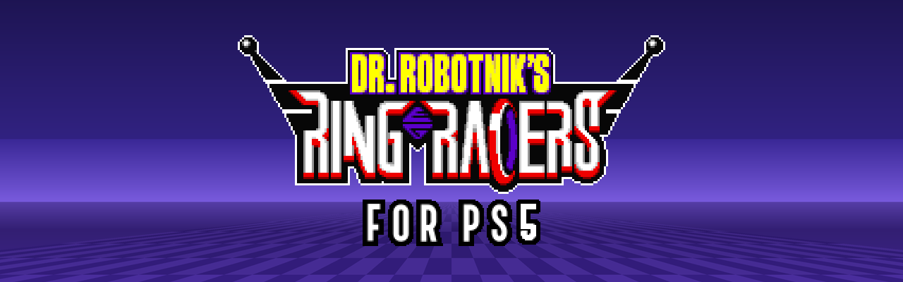

<p align="center">
  
</p>

<p align="center">
  An unofficial port of <a href="https://www.kartkrew.org/">Dr. Robotnik's Ring Racers</a> to jailbroken PlayStation 5 consoles,<br>
  as a native title with its own tile on the home screen.
</p>

---

> **This port is not affiliated with Kart Krew.** Please don't report problems
> with it to them. Open an issue here instead.

## Features

The game is upstream Ring Racers with a PS5 platform layer in place of SDL, so
both renderers, the sound, netplay, add-ons, replays and profiles are the same
as on PC.

- **Up to 4K**: renders at up to 3840x2160, at 60 or 120 Hz
- **DualSense controllers**: up to four players in splitscreen, with rumble and light bar
- **Online play** with other players on this build ([details](docs/PS5.md#online-play-and-versions))
- **USB keyboard** for chat and the console
- **Small download**: the title is about 60 MB and fetches the game data
  (750 MB) from Kart Krew's official release on its first boot

The full list, including what's missing, is in [docs/PS5.md](docs/PS5.md).

## Installing

### What you need

- A PS5 that can run homebrew and launch native title folders. It's been
  played on firmware 13.60 with **etaHEN** and **ShadowMountPlus**.
- An FTP client on your PC (FileZilla, WinSCP, ...)
- An internet connection on the console for the first launch

### Steps

1. **Download the game.** Get `PPSA99620.zip` from the
   [Releases](https://github.com/premohq/PS5-RINGRACERS/releases) page, or
   the `PPSA99620` artifact from the latest green
   [PS5 build](https://github.com/premohq/PS5-RINGRACERS/actions/workflows/ps5.yml)
   run. Unzip it, which gives you a folder called `PPSA99620`.
2. **Copy it to the console.** Connect to your PS5 over FTP and upload the
   whole `PPSA99620` folder (not the zip) into `/data/homebrew/`, so that you
   end up with `/data/homebrew/PPSA99620/eboot.bin`.
3. **Add it to the home screen.** Launch the folder the way your loader
   launches native titles. With ShadowMountPlus, it picks up
   `/data/homebrew/PPSA99620` and Ring Racers gets its own tile.
4. **Start the game.** The first launch shows a download screen: it fetches
   the game data, checks it and unpacks it. Leave it running until it says
   **READY!** If it gets interrupted, starting the game again picks up where
   it left off.
5. **Race!** Every launch after that goes straight to the game.

### Updating

Copy the new `eboot.bin` (or the whole new `PPSA99620` folder) over the old
one. Your game data and saves stay where they are.

### Where things go

Your settings, saves, replays and `latest-log.txt` go to `/data/ringracers/`
when the loader lets the game write there, otherwise to the title's own
storage. Command line arguments can go in `ringracers-args.txt` in the title
folder. More in [docs/PS5.md](docs/PS5.md#where-your-files-go).

**Something not working?** See
[When it does not work](docs/PS5.md#when-it-does-not-work) for what to check
and what to include in an issue.

## Building from source

On Linux or WSL:

```bash
sudo apt install clang-18 lld-18 libclang-rt-18-dev cmake ninja-build python3 python3-venv git curl unzip
tools/ps5/build.sh
```

That fetches every SDK and the game data (pinned and checksummed), builds the
game, and writes the title folder to `build/ps5/dist/PPSA99620/`. Add
`--bundle-data` to put the game data inside the title, for a console that
isn't online. [docs/PS5.md](docs/PS5.md#building) explains the rest, and how
the port is put together.

## Thanks

This port stands entirely on other people's work. Thank you to:

- **[Kart Krew Dev](https://www.kartkrew.org/)** for Dr. Robotnik's Ring
  Racers itself: the game, its code, art and music
  ([source](https://gitlab.com/kart-krew-dev/ring-racers),
  [Discord](https://www.kartkrew.org/discord))
- **[Sonic Team Junior](https://srb2.org/)** for Sonic Robo Blast 2, which
  Ring Racers grew out of
- **[Doom Legacy](http://doomlegacy.sourceforge.net/)** and **id Software**
  for the Doom engine underneath it all
- **[ps5-payload-dev](https://github.com/ps5-payload-dev)** for the PS5
  Payload SDK and the [PacBrew](https://github.com/ps5-payload-dev/pacbrew-repo)
  library ports
- **[BlackBearReloaded](https://github.com/blackbearreloaded)** for
  [ps5-opengl](https://github.com/blackbearreloaded/ps5-opengl) and the
  [native app boilerplate](https://github.com/blackbearreloaded/ps5-native-app-boilerplate)
  that make a native title with OpenGL possible
- **[Mesa](https://mesa3d.org/)**, **[curl](https://curl.se/)**,
  **[OpenSSL](https://www.openssl.org/)**, **[zlib](https://zlib.net/)**,
  **[libpng](http://www.libpng.org/)** and **[Opus](https://opus-codec.org/)**
- The authors of **etaHEN** and **ShadowMountPlus**, and the whole PS5 homebrew
  scene, for opening up the console
- **SEGA** for Sonic and friends
- And a special shoutout to my friend **Mark**, for introducing me to Ring
  Racers. 🏁

## Disclaimer

Dr. Robotnik's Ring Racers is a work of fan art made available for free
without intent to profit or harm the intellectual property rights of the
original works it is based on. Kart Krew Dev is in no way affiliated with SEGA
Corporation, and neither this port nor its author is affiliated with Kart Krew
Dev, SEGA or Sony Interactive Entertainment. No claim is made to any of SEGA's
intellectual property used in Dr. Robotnik's Ring Racers.

## Licence

Ring Racers' source code is available under the GNU General Public License
version 2 or later; see [LICENSE](LICENSE) and
[LICENSE-3RD-PARTY.txt](LICENSE-3RD-PARTY.txt). The PS5 build links components
under the GPL version 3 or later, so a PS5 binary built from this tree is
distributed under the GPL version 3 or later as a whole.
